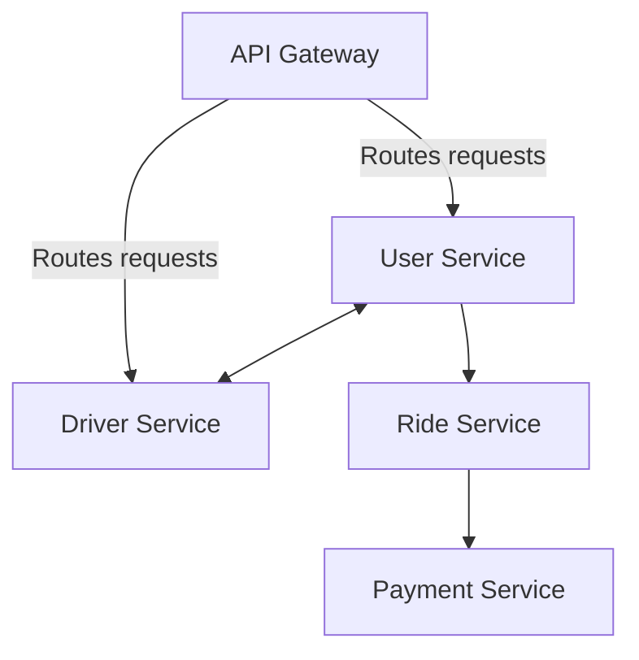

# Go Fleet Microservices Project

[](LICENSE)

A **scalable, distributed ride-sharing system** built with **Go**, demonstrating modern microservices architecture, Docker, and Kubernetes deployment. This project showcases backend development skills, service orchestration, and cloud-ready design.

---

## Table of Contents

- [Overview](#overview)
- [Features](#features)
- [Architecture](#architecture)
- [Technologies Used](#technologies-used)
- [Getting Started](#getting-started)
- [Deployment](#deployment)
- [Usage](#usage)
- [Contributing](#contributing)
- [License](#license)

---

## Overview

GoFleet is a **Uber-style ride-sharing application backend** implemented using **microservices in Go**. The system consists of multiple services communicating via REST and gRPC, orchestrated with Docker and Kubernetes for scalability and reliability.

---

## Features

- User authentication and management
- Ride request and booking service
- Driver location tracking service
- Payment and fare calculation service
- API gateway for routing requests
- Dockerized services for containerized deployment
- Kubernetes manifests for orchestration and scaling
- Centralized logging and monitoring

---

## Architecture



- Each microservice runs independently and communicates via REST/gRPC.
- Services are containerized using Docker and deployed on Kubernetes.
- Scalable architecture allows horizontal scaling of each service.

---

## Technologies Used

- Language: Go (Golang)
- Containerization: Docker
- Orchestration: Kubernetes
- API Communication: REST, gRPC
- Database: PostgreSQL / MongoDB
- Message Queue: RabbitMQ
- Monitoring: Prometheus / Jaegar
- Version Control: Git & GitHub

---

Getting Started

Prerequisites

- Go 1.21+
- Docker
- Kubernetes (Minikube or k8s cluster)
- Git

Installation

# Clone the repository

git clone https://github.com/michael-emmanuel/go-fleet.git
cd go-fleet

# Build Docker images

docker-compose build

# Start services locally

docker-compose up

````

---

## Deployment

1. Apply Kubernetes manifests:

```bash
kubectl apply -f k8s/
````

2. Check pods and services:

```bash
kubectl get pods
kubectl get svc
```

3. Access API via exposed service or Ingress controller.

---

## Usage

- Register users and drivers via API endpoints.
- Request rides and track driver locations in real-time.
- Process payments for completed rides.
- All endpoints documented in [API Documentation](docs/API.md).

---

## Contributing

1. Fork the repository
2. Create a feature branch (`git checkout -b feature-name`)
3. Commit your changes (`git commit -m 'Add feature'`)
4. Push to branch (`git push origin feature-name`)
5. Open a Pull Request

---

## License

This project is licensed under the MIT License - see the [LICENSE](LICENSE) file for details.
